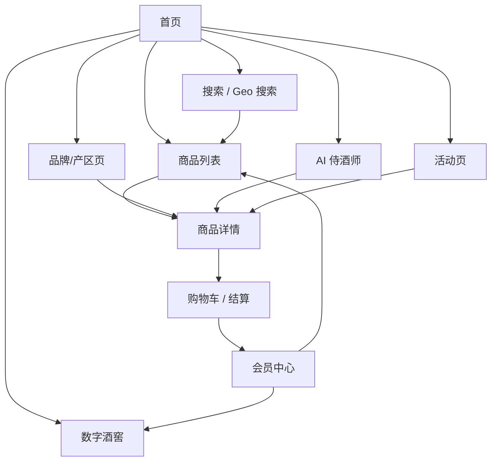
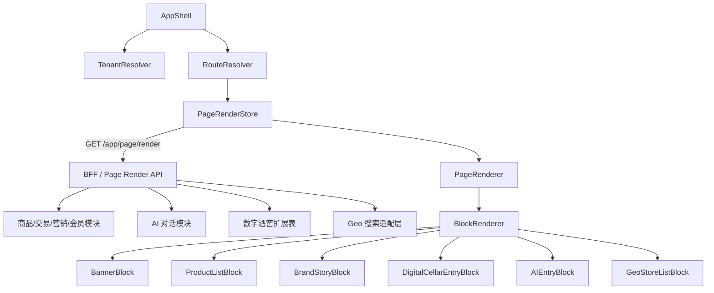
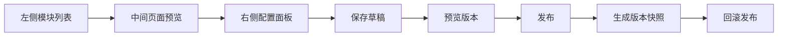

# 酒类 SaaS 电商微信小程序原型设计研究报告

## 执行摘要

基于你当前的目标，最合理的路径不是重做整套后端，而是把芋道源码现有的商城底座当作“交易内核”，把原型、页面搭建器、酒类内容模型、数字酒窖、AI 侍酒师和 Geo 搜索做成一层更适合酒类 SaaS 的前台能力。原因很直接：芋道源码的商城已经覆盖商品、交易、营销、会员等核心模块，并且已经提供商城移动端 uni-app 项目；它的装修体系也已经验证了“页面配置 JSON + 前端组件渲染”的可行性，后台侧同样已经是组件库、设计区、属性配置区三段式结构。换句话说，真正需要被重做的，不是“能不能卖”，而是“酒类场景怎么更好地讲故事、筛选、转化、复购和运营”。citeturn32view2turn32view3turn12view0turn12view2turn26view0

外部样本也很一致地指向这个方向：entity["company","保乐力加中国","china beverages"] 的 DRINKS&CO 小程序强调“多种酒类消费场景”和面向年轻移动用户的社交零售；entity["company","ASC精品酒业","wine importer"] 一方面有小程序商城，另一方面还把教育内容与酒款溯源结合起来；entity["organization","澳大利亚葡萄酒管理局","wine trade body"] 的官方小程序实践说明，行业内容页、活动页、展商/品牌介绍页在酒类场景里不是附属品，而是主路径；entity["company","酒小二","instant alcohol retail"] 说明“附近可买、附近可送、即时到达”是酒类零售非常强的转化杠杆；entity["company","有赞","ecommerce saas"] 的微页面体系则验证了“模板化页面 + 配置化组件 + 非技术可运营”的装修方法论。citeturn6search1turn6search2turn15search1turn15search2turn15search3turn15search8turn8search1turn8search9turn9view2turn28view0turn28view1

技术路线建议采用 **uni-app + Vue3 + Pinia 的 MVP 优先方案**，原因是它与芋道现有商城移动端和装修体系最对齐；同时，uni-app 的 `pages.json` 已经支持 `tabBar`、`subPackages`、`preloadRule`、`easycom` 和 Pinia，但**非 H5 端不支持真正的动态组件**，所以页面渲染器必须做成“静态组件注册表 + `block.type` 显式映射”的模式，而不要依赖运行时 `<component :is>`。Taro 仍然是很好的第二阶段方案，因为它对 Vue3、Pinia、自定义 TabBar、独立分包和跨端请求都有成熟支持，但 Taro 3 的运行时更重，而且小程序环境并不真正支持动态 `import`，会回退为普通 `require`，因此如果你的第一目标是“最快做出可审阅的原型并贴着现有芋道改造”，uni-app 更稳。citeturn26view0turn19view0turn19view1turn19view2turn19view3turn10view0turn25view0turn25view1turn25view2turn25view4turn33search0turn33search1

本报告同时附上一个可点击的中保真 HTML 原型与页面 JSON 样例，便于你直接审阅页面关系和核心模块配置：

- [可点击 HTML 原型预览](sandbox:/mnt/data/wine_saas_miniapp_prototype.html)
- [页面 JSON 样例](sandbox:/mnt/data/wine_saas_page_json_examples.json)

## 研究依据与总体设计原则

酒类小程序和普通快消电商最大的不同，不在“支付链路”，而在“内容和交易要并列”。酒的自然购买决策通常不是从 SKU 开始，而是从场景、预算、口味、送礼对象、品牌认知、产区认知、适饮期、是否可即时送达开始。因此，原型不能只做一个更漂亮的商品列表，而要把“内容导购、专家导购、地理导购、资产导购”全部纳入首版信息架构。这个判断既来自芋道现有 DIY 能力，也来自有赞微页面与行业样本的共性。citeturn12view0turn28view0turn28view1turn28view2

### 样本启发与原型落点

| 样本 | 从样本里读到的有效模式 | 在本原型里的落点 |
|---|---|---|
| DRINKS&CO 小程序 | 不是纯“酒单”，而是按消费场景组织入口 | 首页做“牛排、海鲜、送礼、商务宴请、节日礼盒”等场景导航 |
| ASC 小程序商城 | 商城、教育内容、酒款宽度、溯源信息并行 | 品牌/产区页、详情页中的品牌故事与溯源模块 |
| Wine Australia 官方小程序 | 行业活动、投票、展商/品牌介绍页是主入口而非附页 | 活动页与品牌/产区页做成真正可运营的 landing page |
| 酒小二 | 门店/仓配/即时送达本身就是核心功能 | 搜索页扩展为 Geo 搜索、附近门店、配送范围页 |
| 有赞微页面 | 店铺主页、模板化装修、组件化配置、强运营编辑 | 采用“轻量非拖拽编辑器 + JSON 配置 + 版本发布” |

上表中的样本事实与能力归纳，来自公开官方/一手材料或官方帮助中心。citeturn6search1turn6search2turn15search1turn15search2turn15search3turn15search8turn8search1turn8search9turn9view2turn28view0turn28view1turn28view2

### 总体设计原则

第一，**酒类优先，而不是通用商城优先**。商品卡片之外必须新增品牌故事、产区地图、搭餐建议、口感档案、适饮窗口、真伪/批次溯源、数字酒窖入口、AI 侍酒师入口。

第二，**首页是内容主页，不是只放 banner 的货架页**。有赞把微页面定义为店铺内容主页，而不是“促销图拼贴页面”；对酒类来说，这一点尤其重要。首页应该承担内容导购与交易导购双角色，且首屏轮播尽量控制在 3 张内，尺寸统一。citeturn28view0turn28view1

第三，**编辑器先做“列表式搭建”，不做复杂拖拽**。芋道现有 DIY 已经证明三栏式结构和 JSON 渲染可行，但酒类 SaaS 的第一版更适合“模块列表新增 / 上下排序 / 右侧配置 / 版本发布”的轻编辑器，这样更容易稳定交付，也更适合后续多租户复制模板。芋道现有装修的组件分类本身就很清晰，已经把布局、基础、图文、商品、用户、营销分层好了。citeturn12view0turn24view0turn24view1turn24view2turn24view3

第四，**页面数据必须强租户化**。所有页面配置和页面数据都应该至少显式携带 `tenantId`、`pageCode`、`channel`、`pageVersion`、`memberId?`、`geoContext?` 等标识，避免后续做 SaaS 时出现模板、库存、品牌、活动串租户。

### 酒类模块特征对比

| 模块组 | 通用商城做法 | 酒类 SaaS 应增强的做法 | MVP 是否纳入 |
|---|---|---|---|
| 首页发现 | banner + 分类 + 商品推荐 | 场景导购 + 品牌故事 + AI 入口 + 数字酒窖入口 | 是 |
| 商品列表 | 分类、价格、排序 | 产区/葡萄品种/适饮场景/可送达筛选 | 是 |
| 商品详情 | 规格、价格、图文 | 口感档案、搭餐、醒酒、适饮温度、批次溯源 | 是 |
| 品牌运营 | 单独品牌页较弱 | 品牌馆/产区馆/教育内容页 | 是 |
| 会员运营 | 积分、优惠券、订单 | 酒窖资产、提酒、赠送、收藏品牌/文章 | 是 |
| 搜索 | 关键词搜商品 | 关键词 + 内容 + 附近门店 + 地图选点 + 可送达范围 | 是 |
| AI | 常规客服 | AI 侍酒师、解释型推荐、可转购物车 | 是 |
| 活动运营 | 优惠页 | 节日礼盒、品鉴会、品牌联名活动页 | 是 |

### 站点地图



## 页面清单与低保真原型

### 页面总表

| 页面 | 主任务 | 主 KPI | 酒类专属价值 |
|---|---|---|---|
| 首页 | 导购、种草、场景分发 | 首屏点击率、进入详情率 | 场景选酒、品牌故事、AI 入口、酒窖入口 |
| 商品列表 | 高效筛选与货架浏览 | 筛选使用率、加购率 | 产区/品种/场景/同城可送 |
| 商品详情 | 转化与教育 | 加购率、收藏率 | 口感档案、搭餐、溯源、适饮建议 |
| 品牌/产区页 | 内容运营与高客单导购 | 页面停留时长、品牌转化率 | 品牌故事、产区地图、文章页 |
| 数字酒窖 | 资产运营 | 资产留存、提酒转化 | 在库、陈年、提酒、赠送 |
| 购物车/结算 | 下单 | 提交订单率 | 同城闪送/快递/自提/转入酒窖 |
| 会员中心 | 复购与会员经营 | DAU、券使用率 | 等级、积分、酒窖、内容收藏 |
| AI 侍酒师 | 低门槛导购 | 对话转化率 | 预算/场景/口味推荐 |
| 搜索/Geo 搜索 | 关键词与位置搜索 | 搜索成功率 | 附近门店、配送范围、提酒点 |
| 活动页 | 运营爆发 | 页面转化率 | 节日礼盒、品鉴会、联名页 |

### 首页

| 项 | 内容 |
|---|---|
| 目的 | 把“内容、导购、交易、资产入口”放在同一页，承接社群、公众号、扫码、附近流量与会员回访 |
| 用户流程 | 首页 → 场景入口/品牌馆/AI/热卖 → 详情 → 加购 |
| 必备模块 | `search_bar`、`banner`、`notice_bar`、`menu_grid`、`product_list`、`brand_story`、`digital_cellar_entry`、`ai_entry` |
| 关键数据绑定 | `tenantId`、`pageCode=home`、`memberLevel`、`couponCount`、`featuredProducts`、`brandStories`、`geoContext` |

```json
{
  "pageCode": "home",
  "blocks": [
    { "type": "search_bar", "config": { "placeholder": "搜索酒款 / 产区 / 附近门店" } },
    { "type": "banner", "config": { "scene": "宴请", "imageIds": [11, 12, 13] } },
    { "type": "menu_grid", "config": { "items": ["红酒", "白葡萄酒", "起泡酒", "礼盒", "数字藏酒", "AI选酒", "品牌馆", "同城闪送"] } },
    { "type": "product_list", "config": { "title": "本周热卖", "sourceType": "manual", "productIds": [1001, 1002, 1003] } },
    { "type": "brand_story", "config": { "brandId": 3001 } },
    { "type": "digital_cellar_entry", "config": { "showSummary": true } },
    { "type": "ai_entry", "config": { "prompt": "预算300元，适合烤牛排" } }
  ]
}
```

```text
┌──────────────────────────────┐
│ 搜索框  搜索酒款/产区/附近门店 │
├──────────────────────────────┤
│ Banner 场景海报               │
├──────────────────────────────┤
│ 公告                         │
├──────────────────────────────┤
│ 8宫格：红酒/白葡萄酒/...      │
├──────────────────────────────┤
│ 本周热卖 横滑商品栏           │
├──────────────────────────────┤
│ 品牌故事                     │
├──────────────────────────────┤
│ 数字酒窖入口 | AI 侍酒师入口   │
├──────────────────────────────┤
│ TabBar                       │
└──────────────────────────────┘
```

### 商品列表

| 项 | 内容 |
|---|---|
| 目的 | 把纯商品货架升级为“可解释筛选的酒类货架” |
| 用户流程 | 首页/搜索 → 列表 → 选择筛选条件 → 详情 |
| 必备模块 | `search_bar`、`tabs`、`filter_bar`、`product_list`、`floating_action_button` |
| 关键数据绑定 | `tenantId`、`categoryId`、`regionIds[]`、`grapeIds[]`、`priceRange`、`sceneTags[]`、`canSameCityDelivery` |

```json
{
  "pageCode": "category_list",
  "query": {
    "categoryId": 2101,
    "sort": "sales_desc",
    "filters": {
      "regions": [5001, 5002],
      "grapes": [7001],
      "priceRange": "100_300",
      "sameCity": true
    }
  }
}
```

```text
┌──────────────────────────────┐
│ 搜索框                        │
├──────────────────────────────┤
│ Tab：综合/销量/价格/评分/...   │
├──────────────────────────────┤
│ 筛选条：产区/品种/价格/场景    │
├──────────────────────────────┤
│ 商品卡片1                     │
│ 商品卡片2                     │
│ 商品卡片3                     │
│ ...                           │
├──────────────────────────────┤
│ 悬浮筛选按钮                  │
└──────────────────────────────┘
```

### 商品详情

| 项 | 内容 |
|---|---|
| 目的 | 用“信息解释 + 品牌表达 + 下单”替代“长图堆砌” |
| 用户流程 | 列表 → 详情 → 查看品牌/口感/溯源 → 加购/立即买 |
| 必备模块 | `product_gallery`、`price_panel`、`taste_profile`、`pairing_reco`、`brand_story`、`traceability`、`bottom_action_bar` |
| 关键数据绑定 | `tenantId`、`spuId`、`skuId`、`memberPrice`、`inventory`、`wineProfile`、`trace.batchNo`、`deliveryOptions[]` |

```json
{
  "pageCode": "product_detail",
  "meta": { "spuId": 1001, "skuId": 90001 },
  "blocks": [
    { "type": "product_hero", "source": "spu" },
    { "type": "taste_profile", "source": "wine_profile" },
    { "type": "pairing_reco", "config": { "scene": "steak" } },
    { "type": "brand_story", "config": { "brandId": "$spu.brandId" } },
    { "type": "traceability", "config": { "batchNo": "$sku.batchNo" } }
  ]
}
```

```text
┌──────────────────────────────┐
│ 商品主图 + 名称 + 价格        │
├──────────────────────────────┤
│ 标签：会员价/同城可送/可藏酒   │
├──────────────────────────────┤
│ 口感档案：酒体/单宁/酸度/...   │
├──────────────────────────────┤
│ 搭餐建议                      │
├──────────────────────────────┤
│ 品牌故事                      │
├──────────────────────────────┤
│ 溯源时间线                    │
├──────────────────────────────┤
│ 收藏 | 加购 | 立即购买         │
└──────────────────────────────┘
```

### 品牌/产区页

| 项 | 内容 |
|---|---|
| 目的 | 承担品牌教育、内容运营与高客单导购 |
| 用户流程 | 首页/活动页 → 品牌馆 → 文章/产区/精选酒款 → 详情 |
| 必备模块 | `hero_banner`、`brand_story`、`region_map`、`article_cards`、`product_list` |
| 关键数据绑定 | `tenantId`、`brandId`、`regionId`、`featuredProductIds[]`、`articleIds[]` |

```json
{
  "pageCode": "brand_pavilion",
  "blocks": [
    { "type": "hero_banner", "config": { "brandId": 3001 } },
    { "type": "brand_story", "config": { "brandId": 3001 } },
    { "type": "region_map", "config": { "regionId": 5001 } },
    { "type": "article_cards", "config": { "articleIds": [801, 802] } },
    { "type": "product_list", "config": { "sourceType": "brand", "brandId": 3001 } }
  ]
}
```

```text
┌──────────────────────────────┐
│ 品牌 / 产区头图              │
├──────────────────────────────┤
│ 品牌故事 + 关键词标签         │
├──────────────────────────────┤
│ 产区地图 / 酒庄位置           │
├──────────────────────────────┤
│ 文章卡片：年份、风格、搭餐    │
├──────────────────────────────┤
│ 品牌精选商品                  │
└──────────────────────────────┘
```

### 数字酒窖

| 项 | 内容 |
|---|---|
| 目的 | 把“买酒”升级成“持有和管理一组酒类资产” |
| 用户流程 | 会员中心/首页 → 酒窖 → 查看资产 → 提酒/赠送/查看溯源 |
| 必备模块 | `asset_summary`、`cellar_asset_list`、`maturity_timeline`、`pickup_entry` |
| 关键数据绑定 | `tenantId`、`memberId`、`assetNo`、`storageLocation`、`maturityDate`、`pickupStatus` |

```json
{
  "pageCode": "digital_cellar",
  "query": { "memberId": "$memberId" },
  "blocks": [
    { "type": "asset_summary" },
    { "type": "cellar_asset_list", "config": { "tab": "all" } },
    { "type": "maturity_timeline" },
    { "type": "pickup_entry" }
  ]
}
```

```text
┌──────────────────────────────┐
│ 持有瓶数 / 在库 / 待提酒       │
├──────────────────────────────┤
│ 资产列表                      │
│  - 酒款A  编号  状态          │
│  - 酒款B  编号  状态          │
├──────────────────────────────┤
│ 陈年时间线                    │
├──────────────────────────────┤
│ 提酒 / 转赠 / 查看溯源        │
└──────────────────────────────┘
```

### 购物车与结算

| 项 | 内容 |
|---|---|
| 目的 | 缩短结算路径，同时兼容普通配送、门店自提和转入酒窖 |
| 用户流程 | 详情 → 购物车 → 地址/配送方式/券 → 支付 |
| 必备模块 | `cart_items`、`coupon_selector`、`address_selector`、`delivery_options`、`order_summary` |
| 关键数据绑定 | `tenantId`、`memberId`、`cartId`、`couponId`、`addressId`、`deliveryMode`、`warehouseId` |

```json
{
  "pageCode": "checkout",
  "form": {
    "cartId": "CART-1",
    "couponId": 301,
    "addressId": 9001,
    "deliveryMode": "same_city",
    "invoiceType": "personal"
  }
}
```

```text
┌──────────────────────────────┐
│ 购物车条目                    │
│  - 酒款A x1                  │
│  - 酒款B x1                  │
├──────────────────────────────┤
│ 优惠券                        │
├──────────────────────────────┤
│ 收货方式：闪送/快递/自提/酒窖 │
├──────────────────────────────┤
│ 地址 / 发票                   │
├──────────────────────────────┤
│ 金额明细                      │
├──────────────────────────────┤
│ 应付金额 + 提交订单           │
└──────────────────────────────┘
```

### 会员中心

| 项 | 内容 |
|---|---|
| 目的 | 作为复购、券运营、等级运营、酒窖运营的中心页 |
| 用户流程 | TabBar → 我的 → 订单/券/积分/酒窖/收藏 |
| 必备模块 | `member_card`、`member_order`、`user_wallet`、`user_coupon`、`cellar_entry`、`favorites` |
| 关键数据绑定 | `tenantId`、`memberId`、`levelName`、`points`、`couponCount`、`assetCount`、`favoriteIds[]` |

```json
{
  "pageCode": "member_center",
  "blocks": [
    { "type": "member_card" },
    { "type": "member_order" },
    { "type": "user_wallet" },
    { "type": "user_coupon" },
    { "type": "cellar_entry" },
    { "type": "favorites" }
  ]
}
```

```text
┌──────────────────────────────┐
│ 会员卡：等级 / 积分 / 权益     │
├──────────────────────────────┤
│ 订单状态 4宫格                │
├──────────────────────────────┤
│ 优惠券 / 积分 / 收藏 / 酒窖    │
├──────────────────────────────┤
│ 我的数字酒窖入口              │
├──────────────────────────────┤
│ 收藏内容                      │
└──────────────────────────────┘
```

### AI 侍酒师

| 项 | 内容 |
|---|---|
| 目的 | 提供低门槛、解释型、可直接转购物车的选酒体验 |
| 用户流程 | 首页/详情 → AI 对话 → 推荐结果 → 详情/加购 |
| 必备模块 | `chat_history`、`quick_prompt`、`recommendation_card`、`conversation_disclaimer` |
| 关键数据绑定 | `tenantId`、`memberId`、`conversationId`、`promptTemplates[]`、`recommendedSkuIds[]` |

```json
{
  "pageCode": "ai_chat",
  "conversation": {
    "conversationId": "AI-2026-001",
    "roleCode": "sommelier",
    "context": { "budget": 300, "scene": "steak" }
  }
}
```

```text
┌──────────────────────────────┐
│ 快捷提问：预算/场景/送礼对象   │
├──────────────────────────────┤
│ AI气泡                        │
│ 用户气泡                      │
│ AI气泡                        │
├──────────────────────────────┤
│ 推荐酒款卡片                  │
├──────────────────────────────┤
│ 输入框 + 发送                 │
└──────────────────────────────┘
```

### 搜索 / Geo 搜索

| 项 | 内容 |
|---|---|
| 目的 | 把“搜商品”扩展成“搜商品、搜内容、搜门店、搜配送范围” |
| 用户流程 | 首页搜索 → 关键词联想 / 定位 → 门店列表 / 商品列表 / 提酒点 |
| 必备模块 | `search_bar`、`search_suggestion`、`poi_map`、`store_list`、`delivery_range` |
| 关键数据绑定 | `tenantId`、`keyword`、`lat`、`lng`、`city`、`poiResults[]`、`storeResults[]` |

```json
{
  "pageCode": "search_geo",
  "query": {
    "keyword": "附近门店",
    "lat": 31.2200,
    "lng": 121.4700,
    "city": "上海"
  }
}
```

```text
┌──────────────────────────────┐
│ 搜索框 + 定位                 │
├──────────────────────────────┤
│ Tab：附近门店/同城可送/提酒点 │
├──────────────────────────────┤
│ 地图区域                      │
├──────────────────────────────┤
│ 门店卡片1 距离 营业状态        │
│ 门店卡片2 距离 营业状态        │
│ 门店卡片3 距离 营业状态        │
└──────────────────────────────┘
```

### 活动页

| 项 | 内容 |
|---|---|
| 目的 | 给节日礼盒、品鉴会、品牌联名、限时活动提供独立落地页 |
| 用户流程 | 社群/公众号/广告 → 活动页 → 领券/报名/看商品 → 详情 |
| 必备模块 | `countdown_banner`、`coupon_card`、`magic_cube`、`event_story`、`product_list` |
| 关键数据绑定 | `tenantId`、`activityId`、`startTime`、`endTime`、`couponIds[]`、`relatedProductIds[]` |

```json
{
  "pageCode": "activity_520_gift",
  "blocks": [
    { "type": "countdown_banner", "config": { "activityId": 8801 } },
    { "type": "coupon_card", "config": { "couponIds": [301, 302] } },
    { "type": "magic_cube", "config": { "layout": "1_big_2_small" } },
    { "type": "product_list", "config": { "sourceType": "activity", "activityId": 8801 } }
  ]
}
```

```text
┌──────────────────────────────┐
│ 活动头图 + 倒计时             │
├──────────────────────────────┤
│ 领券卡片                      │
├──────────────────────────────┤
│ 魔方入口：礼盒 / 报名 / 攻略   │
├──────────────────────────────┤
│ 活动精选商品                  │
└──────────────────────────────┘
```

## 中保真交互原型与技术实现

从实现路径看，最稳的方案是：**保留芋道后端，前台用 uni-app + Vue3 + Pinia 做动态页面渲染器；Taro 作为后续多端和设计系统增强路径**。芋道本身已经有 uni-app 商城移动端和 uni-app 管理后台；uni-app 官方侧支持 `pages.json`、`tabBar`、`subPackages`、`preloadRule`、`easycom` 和 Pinia，但非 H5 环境不适合依赖动态组件；Taro 则在 Vue3、自定义 TabBar、独立分包、跨端请求和多端规范上更完整，但官方也明确说明其运行时更重、需要专门做性能优化，且小程序环境不真正支持动态 `import`。citeturn26view0turn19view0turn19view1turn19view2turn19view3turn25view0turn25view1turn25view2turn25view3turn25view4turn33search0turn33search1

### 技术栈建议

| 层 | MVP 推荐 | 备选 |
|---|---|---|
| 小程序前端 | uni-app + Vue3 + Pinia | Taro + Vue3 + Pinia |
| UI 方案 | 自定义 Design Tokens + 轻组件库 | NutUI/Taro UI 风格适配 |
| 网络层 | `uni.request` / 统一 request wrapper | `@tarojs/plugin-http` + axios |
| 页面渲染 | 静态块注册表 + `block.type` 映射 | 静态块注册表 + JSX/模板映射 |
| 分包策略 | 首页主包；AI、酒窖、活动、Geo 分包 | 同上，且可用独立分包 |
| 地图能力 | 位置服务 + 选点插件 | 同上 |
| 原型输出 | H5 HTML 原型 + 页面 JSON | 同上 |

表中的能力归纳基于 uni-app、Taro、芋道官方文档。citeturn26view0turn19view0turn19view1turn19view2turn19view3turn25view0turn25view1turn25view2turn25view4turn33search0turn33search1

### 页面渲染器组件层级



### 组件映射建议

| block.type | uni-app 组件 | 说明 |
|---|---|---|
| `search_bar` | `components/blocks/SearchBarBlock.vue` | 首页、列表、Geo 搜索共用 |
| `banner` | `components/blocks/BannerBlock.vue` | 活动页也可复用 |
| `menu_grid` | `components/blocks/MenuGridBlock.vue` | 场景入口、频道入口 |
| `product_list` | `components/blocks/ProductListBlock.vue` | 支持横滑、双列、三列 |
| `brand_story` | `components/blocks/BrandStoryBlock.vue` | 品牌馆、详情页可复用 |
| `taste_profile` | `components/blocks/TasteProfileBlock.vue` | 酒类详情专属 |
| `traceability` | `components/blocks/TraceabilityBlock.vue` | 批次/真伪/仓储时间线 |
| `digital_cellar_entry` | `components/blocks/DigitalCellarEntryBlock.vue` | 首页、会员中心 |
| `geo_store_list` | `components/blocks/GeoStoreListBlock.vue` | 搜索页、提酒页 |
| `ai_entry` / `ai_reco` | `components/blocks/AIEntryBlock.vue` / `AISommelierRecoBlock.vue` | 对话转商品 |

### 状态管理建议

| Store | 职责 |
|---|---|
| `appStore` | 全局配置、渠道、版本、feature flags |
| `tenantStore` | `tenantId`、品牌主题、门店与仓配策略 |
| `memberStore` | 登录态、等级、积分、券、收藏 |
| `pageStore` | 页面 JSON、版本、缓存、草稿预览态 |
| `catalogStore` | 分类、筛选字典、品牌、产区、葡萄品种 |
| `cartStore` | 购物车、本地选择、提交订单 |
| `cellarStore` | 数字酒窖资产、提酒状态、赠送状态 |
| `aiStore` | 会话、推荐结果、快捷提问模板 |
| `geoStore` | 经纬度、城市、附近门店、配送范围 |

### API 合同建议

芋道现有模块已经把商品、交易、营销、会员拆开，同时 AI 聊天也已经有对话和消息表，所以原型阶段最划算的办法是：**保留原有商品/交易/会员/营销/AI 模块，新增一层 BFF，以及少量酒类扩展表**，例如 `wine_profile`、`wine_brand_story`、`wine_region_article`、`wine_cellar_asset`、`wine_trace_batch`。芋道现有商城模块和 AI 对话模块足够支撑这一步。citeturn32view3turn32view2turn32view1turn32view0

| Method | Endpoint | 用途 |
|---|---|---|
| GET | `/app/page/render?pageCode=home` | 返回页面 JSON |
| GET | `/app/page/render/preview?pageId=123` | 编辑器预览专用 |
| GET | `/app/product/spu/{spuId}` | 商品详情基础数据 |
| GET | `/app/product/list` | 列表、搜索、品牌页商品数据 |
| GET | `/app/wine/profile/{spuId}` | 口感档案、搭餐、适饮信息 |
| GET | `/app/wine/brand/{brandId}` | 品牌故事、品牌馆页 |
| GET | `/app/wine/region/{regionId}` | 产区内容、文章、地图信息 |
| GET | `/app/cellar/assets` | 数字酒窖资产列表 |
| POST | `/app/cellar/pickup/apply` | 提酒申请 |
| GET | `/app/geo/search` | 附近门店、提酒点、配送范围搜索 |
| POST | `/app/ai/sommelier/send` | AI 侍酒师问答 |
| POST | `/app/trade/order/create` | 下单 |

### 页面渲染 API 返回 JSON 示例

```json
{
  "pageCode": "home",
  "tenantId": 10001,
  "version": "2026.04.17.1",
  "theme": {
    "brandColor": "#7A1F1F",
    "accentColor": "#C79A44"
  },
  "blocks": [
    {
      "id": "b1",
      "type": "search_bar",
      "config": {
        "placeholder": "搜索酒款 / 产区 / 附近门店",
        "showLocation": true
      }
    },
    {
      "id": "b2",
      "type": "banner",
      "config": {
        "style": "card",
        "imageRatio": "16:9",
        "images": [
          { "imageUrl": "https://cdn.example.com/a.jpg", "linkType": "scene", "linkValue": "steak" }
        ]
      }
    }
  ]
}
```

### AI 侍酒师请求/响应示例

```json
POST /app/ai/sommelier/send

{
  "conversationId": "AI-2026-001",
  "roleCode": "sommelier",
  "message": "预算300元，适合烤牛排，最好不要太涩",
  "context": {
    "tenantId": 10001,
    "memberLevel": "gold"
  }
}
```

```json
{
  "conversationId": "AI-2026-001",
  "reply": "建议优先看梅洛或波尔多右岸风格……",
  "recommendations": [
    {
      "skuId": 90001,
      "title": "波尔多珍藏干红",
      "price": 299,
      "reason": "单宁较柔和，适合烤牛排"
    }
  ]
}
```

### Geo 搜索请求/响应示例

地图与附近门店建议直接接入 entity["company","腾讯","internet platform"] 位置服务。它同时提供周边搜索、指定区域搜索、矩形搜索；小程序地图选点插件还能返回名称、经纬度、地址与城市，且需要在 `app.json` 里声明 `scope.userLocation` 权限。对于酒类 SaaS，这足够支撑“附近门店”“最近提酒点”“同城可送”三类最核心的 Geo 场景。citeturn29view0turn29view1turn30view0

```json
GET /app/geo/search?keyword=附近门店&lat=31.2200&lng=121.4700&radius=5000
```

```json
{
  "stores": [
    {
      "storeId": 101,
      "name": "虹桥酒类门店",
      "distance": 1200,
      "supports": ["self_pickup", "same_city_delivery"],
      "deliveryEtaMinutes": 45
    }
  ]
}
```

## 页面搭建器与模块模板

芋道现有装修后台，本质上已经是“左侧组件库 + 中间设计区 + 右侧属性面板 + 后端 JSON 存储”的模式；有赞的微页面则进一步证明，首页、图片广告、商品、图文导航、魔方、搜索、公告等组件非常适合标准化配置。对酒类 SaaS 来说，最佳做法不是发明一个更重的拖拽系统，而是沿用这个骨架，先做成 **模块列表式编辑器**：新增模块、上下排序、复制、删除、右侧配置、版本发布。citeturn12view0turn12view2turn28view0turn28view1turn28view2

### 模块能力对比

| 模块组 | 现有通用能力 | 酒类增强能力 |
|---|---|---|
| 基础组件 | 搜索、公告、导航、弹窗、悬浮按钮 | 场景导购入口、年龄提示、门店定位提示 |
| 图文组件 | 图片、轮播、标题、视频、魔方、热区 | 品牌故事、产区地图、溯源时间线 |
| 商品组件 | 商品卡片、商品栏 | 口感标签、搭餐标签、适饮期、同城可送标 |
| 用户组件 | 用户卡、订单、资产、卡券 | 数字酒窖概览、提酒入口、资产估值提示 |
| 营销组件 | 拼团、秒杀、优惠券、营销文章 | 节日礼盒页、品鉴会报名、品牌活动页 |
| AI 组件 | 通用客服入口 | AI 侍酒师入口、推荐卡片、快捷提问 |

### 样板 block 模板

| block_code | 用途 | config_schema_json | default_config_json |
|---|---|---|---|
| `banner` | 首页头图、活动页头图 | `{"fields":[{"name":"images","type":"array","required":true},{"name":"style","type":"enum(card,full)"},{"name":"imageRatio","type":"enum(16:9,3:4,1:1)"},{"name":"autoplay","type":"boolean"}]}` | `{"images":[],"style":"card","imageRatio":"16:9","autoplay":true,"interval":3000}` |
| `product_list` | 货架、品牌精选、活动精选 | `{"fields":[{"name":"title","type":"string"},{"name":"sourceType","type":"enum(manual,category,brand,activity)"},{"name":"display","type":"enum(slide,two_col,three_col,list)"},{"name":"showFields","type":"array"}]}` | `{"title":"推荐酒款","sourceType":"manual","display":"two_col","showFields":["title","price","tag"]}` |
| `brand_story` | 品牌馆、详情页品牌模块 | `{"fields":[{"name":"brandId","type":"number","required":true},{"name":"showTags","type":"boolean"},{"name":"showCta","type":"boolean"}]}` | `{"brandId":0,"showTags":true,"showCta":true,"ctaText":"进入品牌馆"}` |
| `digital_cellar_entry` | 首页、会员中心酒窖入口 | `{"fields":[{"name":"showSummary","type":"boolean"},{"name":"summaryFields","type":"array"},{"name":"ctaText","type":"string"}]}` | `{"showSummary":true,"summaryFields":["assetCount","inStockCount"],"ctaText":"进入酒窖"}` |
| `ai_entry` | 首页和详情页 AI 导购入口 | `{"fields":[{"name":"title","type":"string"},{"name":"presetPrompts","type":"array"},{"name":"showResultPreview","type":"boolean"}]}` | `{"title":"AI侍酒师","presetPrompts":["预算300元","适合牛排","送领导"],"showResultPreview":false}` |

### CMS 编辑器 UX

编辑器交互建议固定为三栏：

- 左栏：模块列表与模板列表。按“通用模块”和“酒类模块”分组，不做自由拖拽画布。
- 中栏：手机预览区。点击某个 block，预览区高亮并滚动到对应位置。
- 右栏：配置面板。使用表单项、条件字段、枚举切换、图片选择器、商品选择器、品牌/产区选择器。
- 顶部：草稿保存、预览、发布、复制版本、回滚。
- 页面级设置：页面名称、页面编码、适用租户、是否首页、分享标题、分享图、SEO/H5 同步配置。



### 发布与版本流

建议至少保留四种状态：

| 状态 | 说明 |
|---|---|
| Draft | 编辑中的草稿，仅运营和设计可见 |
| Preview | 用于测试链接和编辑器预览 |
| Published | 线上版本 |
| Archived | 历史快照，支持回滚 |

版本字段建议至少包含：`versionNo`、`publishedAt`、`publishedBy`、`changeSummary`、`tenantId`、`pageCode`、`isCurrent`。

## 可访问性、性能与交付计划

在可访问性上，酒类电商尤其要避免“只好看、不好点”。按钮、筛选项、底部操作条和聊天快捷提问都应保证足够的触控尺寸与视觉对比；按照 WCAG 2.2，常规文本需要满足对比度要求，触控目标也不应做得过小；移动端研究同样长期建议为触控操作提供足够大的点击区域和可预期反馈。对酒类小程序来说，这会直接影响滑动货架、快速加购、结算表单、AI 对话按钮和地图门店卡片的可用性。citeturn18search0turn18search3turn18search4turn18search15

在性能上，动态页面渲染最容易踩三类坑：首屏过重、组件渲染过深、列表更新过大。建议把首页、会员中心放主包，把 AI、数字酒窖、Geo 搜索、活动页放分包；使用 `preloadRule` 做首页进入后的预下载；首屏只渲染 above-the-fold 模块，品牌故事、横滑商品栏以下的图片懒加载；页面 JSON 以 `tenantId + pageCode + version` 为缓存键，命中缓存时先出骨架再增量更新。对于 uni-app，要坚持静态 block 注册表，不走动态组件；对于 Taro，要意识到它运行时较重，需额外关注编译与运行时性能优化。citeturn19view2turn19view3turn18search1turn18search10turn31search3turn33search1

Geo 搜索的性能策略要独立设计。附近门店、提酒点和同城可送最好分两层缓存：一层缓存用户经纬度与城市信息，一层缓存搜索结果；搜索 API 只返回门店必要字段，商品明细进入门店详情或商品详情时再补查。位置服务支持周边、区域和矩形三种搜索形式，而地图选点插件可直接回传位置名、经纬度、地址和城市，这正好适合“附近门店”和“填写提酒地址”两类核心场景。citeturn29view0turn29view1turn30view0

### 需要交付给设计师与开发的产物

| 交付物 | 格式 | 作用 |
|---|---|---|
| 站点地图 | Mermaid / Figma | 明确主路径和跳转关系 |
| 低保真线框 | 本报告 ASCII + Figma | 确认信息结构，不纠结视觉细节 |
| 中保真原型 | [HTML 原型](sandbox:/mnt/data/wine_saas_miniapp_prototype.html) | 审阅页面关系与模块交互 |
| 页面 JSON 样例 | [JSON 文件](sandbox:/mnt/data/wine_saas_page_json_examples.json) | 前后端对齐数据结构 |
| Block Schema 文档 | Markdown / JSON Schema | 为搭建器字段和渲染器对齐 |
| Design Tokens | Figma Variables / JSON | 颜色、圆角、字号、阴影统一 |
| API 合同 | OpenAPI / Markdown | 前后端联调依据 |
| CMS 编辑器说明 | PRD / 流程图 | 定义草稿、预览、发布、回滚 |
| QA 检查单 | Excel / Markdown | 性能、可访问性、页面回归 |

### 工时估算

下表以“一个可上线 MVP”而不是“完整商业化大版本”为口径，默认配置为：产品 1 人、设计 1 人、前端 1 人、后端 1 人、测试 0.5 人。

| 阶段 | 主要产出 | 估算人周 |
|---|---|---|
| 需求梳理与 IA | 页面范围、角色流、模块清单 | 1.0 |
| 低保真与交互稿 | 10 页线框 + 路径修正 | 1.5 |
| 视觉与组件规范 | 设计系统、酒类标签体系 | 1.5 |
| 小程序壳子与路由 | AppShell、TabBar、登录态、主题 | 1.0 |
| 页面渲染器与 Block 基础库 | PageRenderer、BlockRenderer、5 个模板块 | 2.0 |
| 核心页面开发 | 首页、列表、详情、活动、会员 | 2.0 |
| Geo 搜索与地图接入 | 附近门店、提酒点、地图选点 | 1.0 |
| AI 侍酒师 MVP | 对话页、快捷提问、推荐结果卡 | 1.0 |
| 数字酒窖 MVP | 资产列表、提酒申请、状态页 | 1.0 |
| 后端 BFF 与接口整合 | page render、酒类扩展表、聚合接口 | 2.0 |
| 联调与测试 | 功能回归、性能、可访问性 | 1.0 |

**MVP 合计建议：约 12–14 人周。**

### 后续阶段建议

| 阶段 | 范围 | 估算人周 |
|---|---|---|
| 下一阶段 | 品牌馆增强、内容 CMS、活动页模板化、Geo 搜索优化、AI 提示词运营 | 6–8 |
| 再下一阶段 | 数字酒窖完整资产生命周期、转赠、仓储联动、多语言、H5/官网同步 SEO 页面 | 8–12 |
| 长期阶段 | 数字人导购、AI 客服知识库、门店导购助手、租户模板市场 | 8–12 |

综合来看，这个项目最值得立即推进的不是“大而全”，而是先把 **首页、列表、详情、品牌馆、AI 侍酒师、数字酒窖、Geo 搜索、活动页** 这 8 类真正体现酒类差异化的页面做准，再用一个简化版页面搭建器把它们模板化。这样既不浪费芋道现有交易能力，也能尽快把你的酒类 SaaS 做出清晰卖点：**更懂酒、更会讲故事、更会导购、更适合连锁门店和品牌运营**。